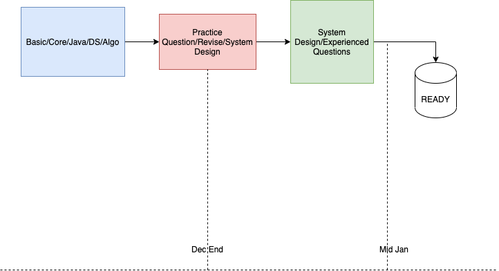

# Software Engineering Interview Preparation

See [this post](https://orrsella.com/2016/05/14/preparing-for-a-facebook-google-software-engineer-interview/) and [this](https://orrsella.com/2016/05/28/preparing-for-a-system-architecture-interview/) for more background and tips on preparing for an interview.

Check this flow : 

Start from [SUMMARY](https://github.com/orrsella/soft-eng-interview-prep/blob/master/SUMMARY.md) (or see below). It's also available in [GitBook format](https://orrsella.gitbooks.io/soft-eng-interview-prep/content/) for easier reading and navigation.

## A.1 Topics
- [x] [Complexity](topics/complexity.md)
- [x] [Data Structures](topics/data-structures.md)
- [ ] [~~Data Structures Examples~~](topics/data-structures-examples.md)
- [ ] [~~Algorithms~~](topics/algorithms.md)
- [ ] [~~Algorithms Examples~~](topics/algorithms-examples.md)
- [x] [Bit Operators](topics/bit-operators.md)
- [x] [Numbers](topics/numbers.md)
- [x] [Operating Systems](topics/operating-systems.md)
- [x] [System Architecture](topics/system-architecture.md)
- [x] [System Architecture Examples](topics/system-architecture-examples.md)
- [x] [Networking](topics/networking.md)
- [x] [Strings](topics/strings.md)
- [x] [Java](topics/java.md)
- [x] [Java Examples](topics/java-examples.md)
- [x] [OOP](topics/oop.md)
- [x] [P,NP](topics/p-np.md)

## A.2 Topics
[Hyperskills jetbrains](https://hyperskill.org/curriculum)
  - [ ] java
  - [ ] algorithms
    - [ ] graphs
  - [x] essentials
  - [x] devtools
  - [x] databases
  - [ ] maths

## B.1 More to follow
- [ ] [Design repository](https://github.com/prshntsuyl/system-design-interview)
- [x] [Tech Interview handbook](https://yangshun.github.io/tech-interview-handbook/introduction/)
- [ ] [Java Guide | Walkthrough atleast once](https://snailclimb.gitee.io/javaguide/#/)

## B.2 Practice questions
- [Here](extras/readme.md)

## C.1 Last Stage
- [ ] [System Design Primer](https://github.com/prshntsuyl/design-primer)
  - [ ] [Youtube Playlist](https://youtu.be/UzLMhqg3_Wc?list=PLrmLmBdmIlps7GJJWW9I7N0P0rB0C3eY2&t=442): ~~1,2,3,4~~,5
- [ ] Experienced Practice questions
- [ ] Tech Primer
  - [ ] Serverless
- [ ] Manage Microservices book walkthrough
- [ ] Spring boot book walkthrough

## C.2 Nice to have
- [ ] Data Science skills
- [ ] ML skills

